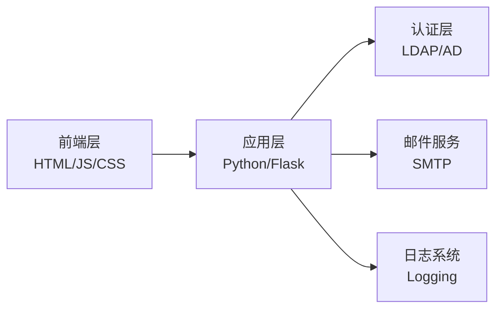

# 域账号密码重置系统(LDAP/AD)

[English Version](README_EN.md)

[](https://www.python.org/)
[](https://flask.palletsprojects.com/)
[](https://getbootstrap.com/)
[](LICENSE)

## 目录

- [项目概述](#项目概述)
- [系统架构](#系统架构)
- [核心功能](#核心功能)
- [API文档](#api文档)
- [技术栈](#技术栈)
- [快速开始](#快速开始)
- [部署指南](#部署指南)
- [测试](#测试)
- [运维指南](#运维指南)
- [贡献指南](#贡献指南)
- [许可证](#许可证)

## 项目概述

域账号密码重置系统是一个安全、高效的自助式密码重置平台。本系统通过多重安全机制，使用户能够安全地重置其域账号密码，同时降低IT支持团队的工作负担。

### 安全特性

- ✅ 双因素身份验证（用户名 + 邮箱）
- 🔒 邮箱验证码机制
- 🛡️ 密码强度校验
- 📝 全程操作日志记录
- 🔑 LDAP安全连接

## 系统架构



### 组件说明

| 层级 | 技术栈 | 主要职责 |
|------|--------|---------|
| 前端层 | HTML5/CSS3/JS | 用户界面交互 |
| 应用层 | Python/Flask | 业务逻辑处理 |
| 认证层 | LDAP/AD | 域账号管理 |
| 服务层 | SMTP | 邮件通知 |

## 核心功能

- **账号验证**
  - 用户名有效性检查
  - 邮箱地址匹配验证
  - 防暴力破解机制

- **密码管理**
  - 复杂度要求：
    - 最小长度：8位
    - 必须包含：大写字母、小写字母、数字、特殊字符
    - 不允许使用最近使用过的密码
  - 密码强度实时检测
  - 密码历史记录检查

- **安全机制**
  - 验证码有效期控制
  - 操作频率限制
  - 会话管理
  - 全程HTTPS加密

## API文档

### 1. 发送验证码

```http
POST /api/send-code
```

**请求参数**

| 参数名 | 类型 | 必填 | 说明 |
|--------|------|------|------|
| username | string | 是 | 域账号用户名 |
| email | string | 是 | 注册邮箱地址 |

**响应示例**

✅ 成功响应
```json
{
    "success": true,
    "message": "验证码已发送到您的邮箱"
}
```

❌ 错误响应
```json
{
    "success": false,
    "message": "用户名或邮箱地址无效"
}
```

### 2. 获取配置

```http
GET /api/get-config
```

**响应示例**

```json
{
    "api_base_url": "http://10.0.0.70:5001/api"
}
```

### 3. 重置密码

```http
POST /api/reset-password
```

**请求参数**

| 参数名 | 类型 | 必填 | 说明 |
|--------|------|------|------|
| username | string | 是 | 域账号用户名 |
| email | string | 是 | 注册邮箱地址 |
| code | string | 是 | 验证码 |
| new_password | string | 是 | 新密码 |

**响应示例**

✅ 成功响应
```json
{
    "success": true,
    "message": "密码重置成功"
}
```

## 技术栈

### 前端技术
- HTML5 + CSS3
- JavaScript (ES6+)
- Bootstrap 5
- Jest (单元测试)

### 后端技术
- Python 3.12
- Flask (Web框架)
- LDAP3 (域控制器交互)
- pywinrm (Windows远程管理)
- pytest (单元测试)

### 基础设施
- SMTP服务器 (邮件发送)
- LDAP/AD服务器 (域账号管理)
- Logging (日志管理)

## 快速开始

### API地址配置

1. 修改`.env`文件中的`SERVER_IP`为实际服务器IP地址
2. 前端页面加载时会自动获取API地址
3. 如果获取失败，将使用`localhost`作为默认值

### 跨域访问

### 环境要求
- Python 3.12+
- Node.js 16+
- LDAP服务器
- SMTP服务器

### 本地开发环境搭建

1. 克隆项目
```bash
git clone https://github.com/Jas0nxlee/AD-Reset.git
cd password-reset
```

2. 后端环境配置
```bash
cd backend
python3 -m venv venv
source venv/bin/activate  # Windows使用: .\venv\Scripts\activate
pip install -r requirements.txt
```

requirements.txt 包含以下主要依赖：
- Flask==2.3.2
- Flask-CORS==4.0.0
- python-dotenv==1.0.0
- ldap3==2.9.1
- pywinrm==0.4.3

3. 环境变量配置
创建 `.env` 文件：
```ini
# LDAP配置
LDAP_SERVER=your_ldap_server
LDAP_PORT=389
LDAP_BASE_DN=DC=your_domain,DC=com
LDAP_USER_DN=CN=admin,DC=your_domain,DC=com
LDAP_PASSWORD=your_ldap_password

# SMTP配置
SMTP_SERVER=your_smtp_server
SMTP_PORT=587
SMTP_USERNAME=your_smtp_username
SMTP_PASSWORD=your_smtp_password

# 服务器配置
SERVER_IP=your_server_ip  # 服务器实际IP地址
PORT=5001  # Flask应用端口
```

4. 启动服务
```bash
# 后端服务
python app.py

# 前端服务（新终端）
cd ../frontend
python -m http.server 8000
```

## 测试

### 后端测试
```bash
cd backend
pytest tests/ -v --cov=app --cov-report=html
```

### 日志查看
```bash
tail -f logs/password_reset.log
```

## 运维指南

### 日志管理

- **位置**: `backend/logs/password_reset.log`
- **轮转策略**: 
  - 单文件最大：10MB
  - 保留文件数：5个
- **日志格式**:
  ```
  [2025-01-14 09:00:00] - [INFO] - 用户操作信息
  ```

### 监控要点

- 系统健康度
  - API响应时间
  - 错误率监控
  - 资源使用率

- 安全监控
  - 失败尝试次数
  - 可疑IP活动
  - 异常操作模式

### 安全维护

1. 定期更新
   - 系统依赖包
   - SSL证书
   - 安全补丁

2. 访问控制
   - API访问频率限制
   - IP白名单
   - 会话超时设置

## 贡献指南

1. Fork 项目
2. 创建特性分支 (`git checkout -b feature/AmazingFeature`)
3. 提交更改 (`git commit -m 'Add some AmazingFeature'`)
4. 推送到分支 (`git push origin feature/AmazingFeature`)
5. 提交 Pull Request

### 贡献要求

- ✅ 添加单元测试
- 📝 更新相关文档
- 🎨 遵循代码规范
- 🔍 通过所有测试

## 许可证

本项目采用 MIT 许可证 - 详情请参阅 [LICENSE](LICENSE) 文件