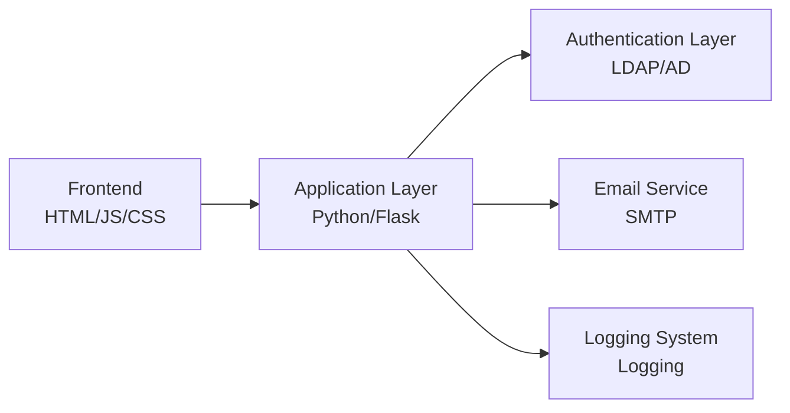

# LDAP/AD Account Password Reset System

[](https://www.python.org/)
[](https://flask.palletsprojects.com/)
[](https://getbootstrap.com/)
[](LICENSE)

[中文版](README.md)

## Table of Contents

- [Project Overview](#project-overview)
- [System Architecture](#system-architecture)
- [Core Features](#core-features)
- [API Documentation](#api-documentation)
- [Technology Stack](#technology-stack)
- [Quick Start](#quick-start)
- [Deployment Guide](#deployment-guide)
- [Testing](#testing)
- [Operations Guide](#operations-guide)
- [Contribution Guide](#contribution-guide)
- [License](#license)

## Project Overview

The Domain Account Password Reset System is a secure and efficient self-service password reset platform. Through multiple security mechanisms, this system enables users to securely reset their domain account passwords while reducing the workload of IT support teams.

### Security Features

- ✅ Two-factor authentication (username + email)
- 🔒 Email verification code mechanism
- 🛡️ Password strength validation
- 📝 Full operation log recording
- 🔑 LDAP secure connection

## System Architecture



### Component Description

| Layer | Technology Stack | Main Responsibilities |
|-------|------------------|-----------------------|
| Frontend | HTML5/CSS3/JS | User interface interaction |
| Application | Python/Flask | Business logic processing |
| Authentication | LDAP/AD | Domain account management |
| Service | SMTP | Email notification |

## Core Features

- **Account Verification**
  - Username validity check
  - Email address matching verification
  - Anti-brute force mechanism

- **Password Management**
  - Complexity requirements:
    - Minimum length: 8 characters
    - Must contain: uppercase, lowercase, numbers, special characters
    - Cannot use recently used passwords
  - Real-time password strength detection
  - Password history check

- **Security Mechanisms**
  - Verification code expiration control
  - Operation frequency limit
  - Session management
  - Full HTTPS encryption

## API Documentation

### 1. Send Verification Code

```http
POST /api/send-code
```

**Request Parameters**

| Parameter | Type | Required | Description |
|-----------|------|----------|-------------|
| username | string | Yes | Domain account username |
| email | string | Yes | Registered email address |

**Response Example**

✅ Success Response
```json
{
    "success": true,
    "message": "Verification code has been sent to your email"
}
```

❌ Error Response
```json
{
    "success": false,
    "message": "Invalid username or email address"
}
```

### 2. Get Configuration

```http
GET /api/get-config
```

**Response Example**

```json
{
    "api_base_url": "http://10.0.0.70:5001/api"
}
```

### 3. Reset Password

```http
POST /api/reset-password
```

**Request Parameters**

| Parameter | Type | Required | Description |
|-----------|------|----------|-------------|
| username | string | Yes | Domain account username |
| email | string | Yes | Registered email address |
| code | string | Yes | Verification code |
| new_password | string | Yes | New password |

**Response Example**

✅ Success Response
```json
{
    "success": true,
    "message": "Password reset successful"
}
```

## Technology Stack

### Frontend Technologies
- HTML5 + CSS3
- JavaScript (ES6+)
- Bootstrap 5
- Jest (Unit Testing)

### Backend Technologies
- Python 3.12
- Flask (Web Framework)
- LDAP3 (Domain Controller Interaction)
- pywinrm (Windows Remote Management)
- pytest (Unit Testing)

### Infrastructure
- SMTP Server (Email Sending)
- LDAP/AD Server (Domain Account Management)
- Logging (Log Management)

## Quick Start

### API Address Configuration

1. Modify `SERVER_IP` in `.env` file to actual server IP address
2. Frontend will automatically get API address when loading
3. If failed, will use `localhost` as default

### Cross-Origin Access

### Environment Requirements
- Python 3.12+
- Node.js 16+
- LDAP Server
- SMTP Server

### Local Development Setup

1. Clone project
```bash
git clone https://github.com/your-repo/password-reset.git
cd password-reset
```

2. Backend environment setup
```bash
cd backend
python3 -m venv venv
source venv/bin/activate  # Windows: .\venv\Scripts\activate
pip install -r requirements.txt
```

requirements.txt includes following main dependencies:
- Flask==2.3.2
- Flask-CORS==4.0.0
- python-dotenv==1.0.0
- ldap3==2.9.1
- pywinrm==0.4.3

3. Environment variables configuration
Create `.env` file:
```ini
# LDAP Configuration
LDAP_SERVER=your_ldap_server
LDAP_PORT=389
LDAP_BASE_DN=DC=your_domain,DC=com
LDAP_USER_DN=CN=admin,DC=your_domain,DC=com
LDAP_PASSWORD=your_ldap_password

# SMTP Configuration
SMTP_SERVER=your_smtp_server
SMTP_PORT=587
SMTP_USERNAME=your_smtp_username
SMTP_PASSWORD=your_smtp_password

# Server Configuration
SERVER_IP=your_server_ip  # Actual server IP address
PORT=5001  # Flask application port
```

4. Start services
```bash
# Backend service
python app.py

# Frontend service (new terminal)
cd ../frontend
python -m http.server 8000
```

## Testing

### Backend Testing
```bash
cd backend
pytest tests/ -v --cov=app --cov-report=html
```

### Log Viewing
```bash
tail -f logs/password_reset.log
```

## Operations Guide

### Log Management

- **Location**: `backend/logs/password_reset.log`
- **Rotation Policy**:
  - Single file max size: 10MB
  - Retained files: 5
- **Log Format**:
  ```
  [2025-01-14 09:00:00] - [INFO] - User operation information
  ```

### Monitoring Points

- System Health
  - API response time
  - Error rate monitoring
  - Resource utilization

- Security Monitoring
  - Failed attempts count
  - Suspicious IP activity
  - Abnormal operation patterns

### Security Maintenance

1. Regular Updates
   - System dependencies
   - SSL certificates
   - Security patches

2. Access Control
   - API access rate limiting
   - IP whitelist
   - Session timeout settings

## Contribution Guide

1. Fork the project
2. Create your feature branch (`git checkout -b feature/AmazingFeature`)
3. Commit your changes (`git commit -m 'Add some AmazingFeature'`)
4. Push to the branch (`git push origin feature/AmazingFeature`)
5. Open a Pull Request

### Contribution Requirements

- ✅ Add unit tests
- 📝 Update relevant documentation
- 🎨 Follow code style guidelines
- 🔍 Pass all tests

## License

This project is licensed under the MIT License - see the [LICENSE](LICENSE) file for details